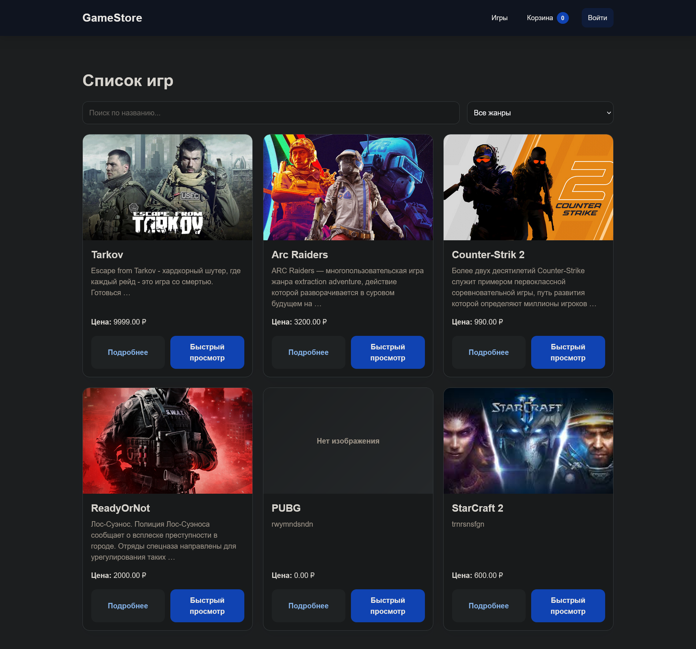
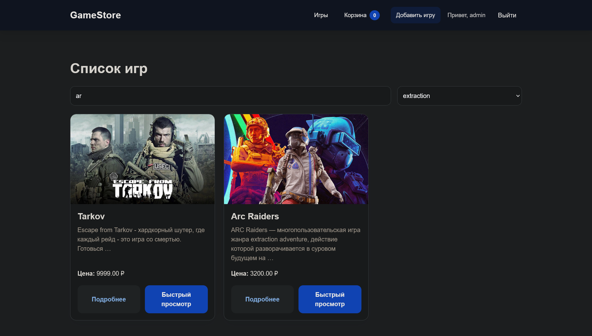
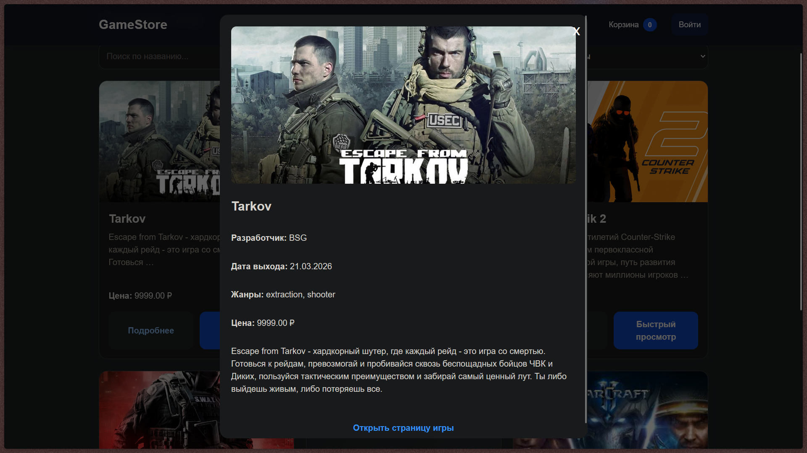
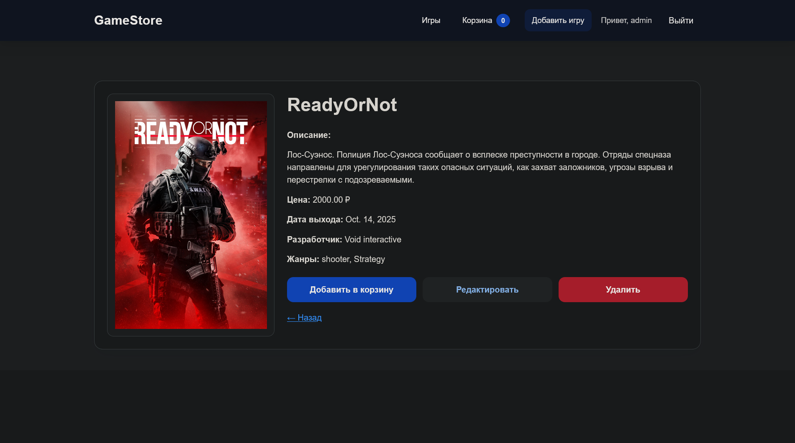
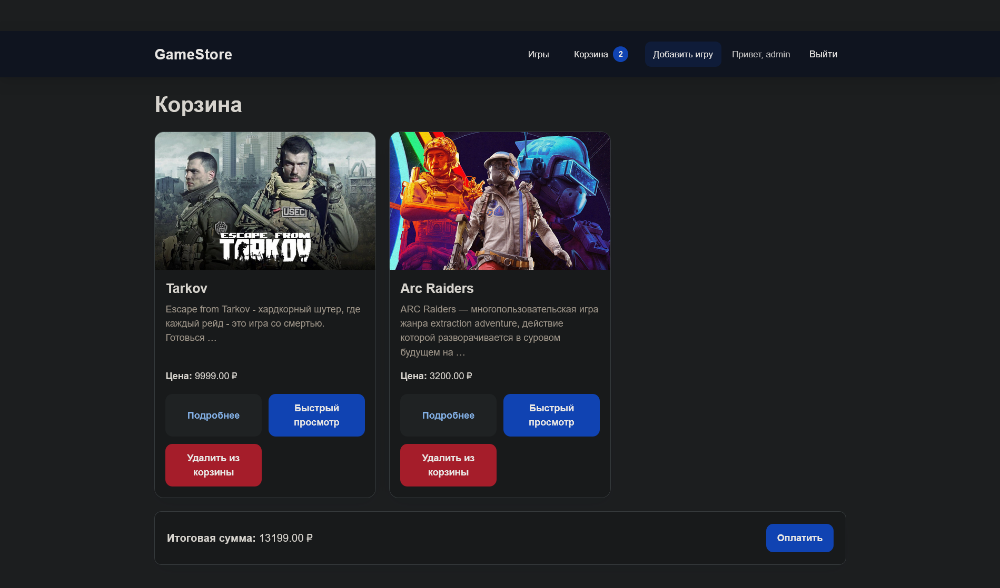
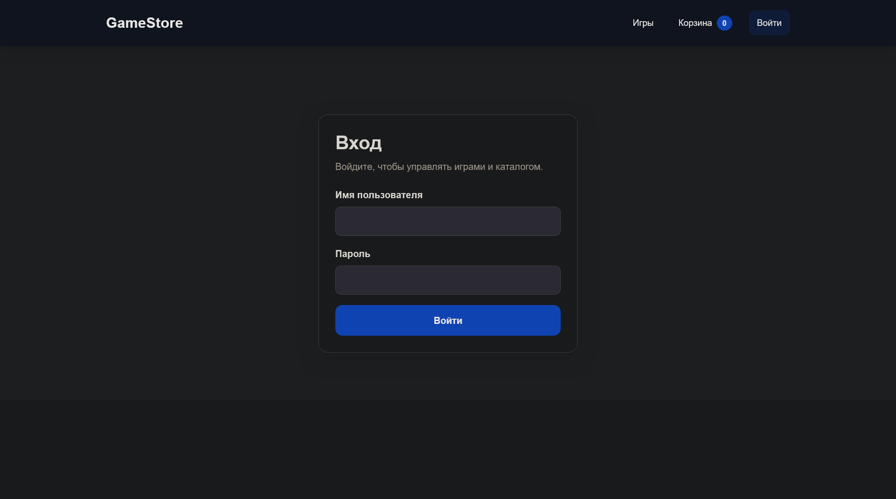
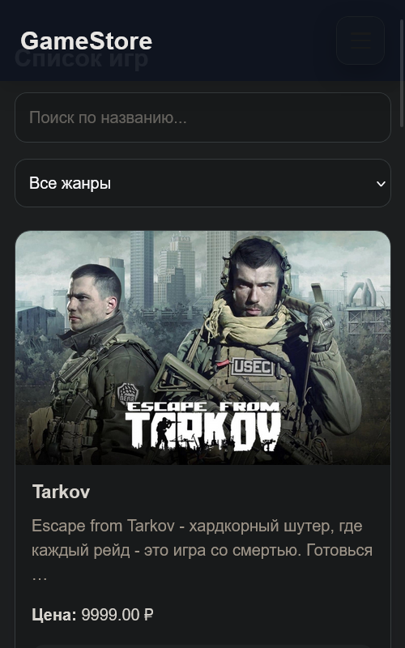

# GameStore

Адаптивное веб-приложение на **Django** для каталога видеоигр с CRUD-операциями, поиском и фильтрацией без перезагрузки страницы, модальным окном быстрого просмотра и корзиной на основе session.

## О проекте

Проект представляет собой упрощённый интернет-магазин видеоигр. Основная цель — показать полноценную работу с Django на практике: модели, формы, шаблоны, маршрутизацию, авторизацию, асинхронные запросы на JavaScript и адаптивный интерфейс.

Приложение позволяет просматривать каталог игр, открывать подробную информацию о каждой игре, выполнять поиск и фильтрацию без обновления страницы, быстро просматривать игру в модальном окне, добавлять игры в корзину и оформлять условную покупку. Для администратора доступны операции создания, редактирования и удаления записей.

## Основные возможности

### Каталог игр
- просмотр списка всех игр;
- детальная страница игры;
- вывод изображения, описания, цены, разработчика, даты выхода и жанров;
- модальное окно быстрого просмотра без перехода на отдельную страницу.

### Работа с данными
- создание новой игры через форму;
- редактирование существующей игры;
- удаление игры с подтверждением;
- защита операций изменения данных через авторизацию.

### Поиск и фильтрация
- поиск по названию;
- фильтрация по жанру;
- обновление списка без перезагрузки страницы;
- индикатор загрузки во время асинхронного запроса.

### Корзина
- добавление игр в корзину;
- хранение корзины в `session`;
- подсчёт количества товаров и общей суммы;
- удаление игр из корзины;
- имитация оформления покупки с очисткой корзины и сообщением об успешной операции.

### JavaScript-интерактивность
- модальное окно быстрого просмотра;
- AJAX-фильтрация списка;
- анимация добавления игры в корзину;
- пульсация счётчика корзины;
- tilt-эффект карточек игр;
- мобильное навигационное меню.

### Адаптивный дизайн
Интерфейс адаптирован под:
- компьютеры;
- планшеты;
- мобильные телефоны.

На маленьких экранах меню сворачивается в бургер-кнопку, карточки перестраиваются в одну колонку, а формы и кнопки остаются удобными для взаимодействия.

## Стек технологий
- **Python 3**
- **Django**
- **SQLite**
- **HTML5**
- **CSS3**
- **JavaScript (Fetch API)**
- **Session-based storage** для корзины

## Модели данных

### Genre
Модель жанра игры.

Поля:
- `name` — название жанра.

### Game
Основная модель игры.

Поля:
- `name` — название игры;
- `description` — описание;
- `price` — цена;
- `release_date` — дата выхода;
- `developer` — разработчик;
- `genres` — связь многие-ко-многим с жанрами;
- `image` — изображение игры.

## Структура проекта

```text
GameStore/
├── django_project/
│   ├── django_project/
│   │   ├── settings.py
│   │   ├── urls.py
│   │   └── ...
│   ├── games/
│   │   ├── models.py
│   │   ├── views.py
│   │   ├── forms.py
│   │   ├── urls.py
│   │   ├── cart.py
│   │   ├── context_processors.py
│   │   ├── templates/
│   │   └── ...
│   ├── static/
│   │   ├── css/
│   │   └── js/
│   ├── manage.py
│   └── requirements.txt
└── README.md
```

## Как запустить проект

### 1. Клонировать репозиторий

```bash
git clone https://gitlab.ngknn.ru/Programmers/31p2025/djangogamestore.git
cd djangogamestore
```

### 2. Создать и активировать виртуальное окружение

**Windows:**

```bash
python -m venv venv
venv\Scripts\activate
```

**Linux / macOS:**

```bash
python3 -m venv venv
source venv/bin/activate
```

### 3. Установить зависимости

```bash
pip install -r requirements.txt
```

### 4. Применить миграции

```bash
python manage.py makemigrations
python manage.py migrate
```

### 5. Создать суперпользователя

```bash
python manage.py createsuperuser
```

### 6. Запустить сервер

```bash
python manage.py runserver
```

После запуска проект будет доступен по адресу:

```text
http://127.0.0.1:8000/
```

## Авторизация

Для выполнения операций создания, редактирования и удаления игр нужно войти в систему.

Страница входа:

```text
/accounts/login/
```

## Скриншоты интерфейса

Ниже приведены рекомендуемые скриншоты для README.

### Главная страница



### Поиск и фильтрация



### Модальное окно быстрого просмотра



### Детальная страница игры



### Корзина



### Страница входа



### Адаптивный интерфейс



## Итог

Проект демонстрирует полноценную разработку Django-приложения с акцентом на практическую пользу: CRUD, работа с моделями, формы, авторизация, асинхронные запросы, session-корзина, JavaScript-интерактивность и адаптивный интерфейс.
